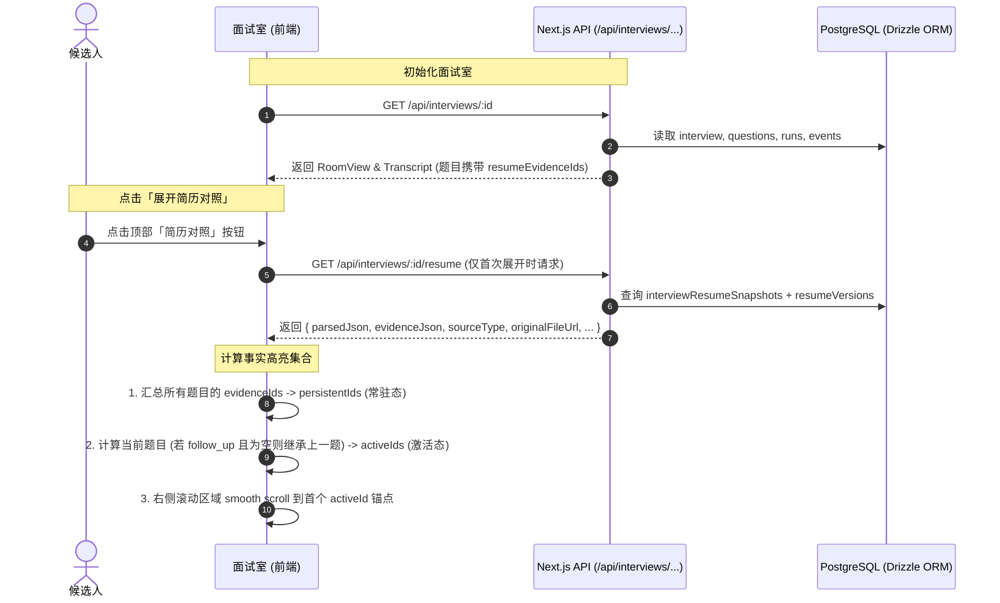

# 面试室简历查看与事实动态高亮技术设计规范

## 1. 概述与设计目标

在 AI 模拟面试过程中，候选人需要能够随时对照查看与当前面试完全绑定的简历版本，并清晰感知面试官当前提问所引用的简历事实依据。

### 核心功能目标
1. **当前版本简历查看**：面试室支持查看当次面试所固化的简历快照（包括结构化解析视图与 PDF 原件视图）。
2. **两列自适应与可拖拽分栏布局**：
   - 默认保持单列专注答题视图；
   - 顶部提供「简历对照」展开/折叠切换；
   - 展开时呈现左右分栏，两栏之间支持鼠标拖拽调节宽度，并设立安全最小宽度（左侧问答栏最小 `420px`，右侧简历栏最小 `380px`），支持双击把手复位；
   - 移动端（`< lg`）优雅降级为滑出抽屉。
3. **双层事实高亮体系（常驻态 vs 激活态）**：
   - **常驻高亮（Persistent Highlight）**：整场面试中所有被提问过的事实均保持柔和底色，宏观展现“已考察事实覆盖范围”；
   - **当前激活态（Active Highlight）**：当前正在作答题目引用的事实升级为鲜艳高饱和度高亮（如琥珀金发光边框），并附带徽章提示。
4. **追问继承（Follow-up Fallback）**：
   - 当遇到追问（`follow_up`）且该追问未提取出新增简历事实时，自动沿用其前序所属主问题（`main`）的事实作为激活态，确保上下文线索不中断。
5. **智能对齐定位**：
   - 展开简历栏或切换当前题目时，简历视图平滑滚动（`scrollIntoView`）至首个激活态事实处。
   - 在左侧钢琴键轨道或对话流中回看历史题目时，右侧激活态同步联动切换。

---

## 2. 系统架构与数据流设计



### 2.1 简历快照接口：`GET /api/interviews/[id]/resume`
* **端点**：`/api/interviews/[id]/resume`
* **鉴权**：校验当前登录用户必须为该面试的归属者（`interview.userId === currentUserId`）。
* **数据源**：
  * 主表：`interview_resume_snapshots`
  * 关联表：`resume_versions`（通过 `resume_version_id` 获取 `stored_path` 和 `original_filename`）
* **响应格式**：
  ```ts
  export interface InterviewResumeSnapshotResponse {
    interviewId: string;
    resumeId: string;
    resumeVersionId: string;
    resumeTitle: string;
    versionNumber: number;
    sourceType: "uploaded" | "generated";
    parsedJson: ParsedResume;
    evidenceJson: Record<string, { path: string; text: string }>;
    originalFileUrl: string | null;
    originalFilename: string | null;
  }
  ```

### 2.2 投影数据增强（透传 `resumeEvidenceIds`）
在现有的 `lib/interview/projections/` 中，将题目已有的 `resume_evidence_ids` 字段向客户端暴露：
1. **`InterviewQuestionView`**（当前正在回答的题目）：
   ```ts
   export interface InterviewQuestionView {
     id: string;
     sequence: number;
     kind: "main" | "follow_up";
     topic: string;
     content: string;
     tip: string | null;
     resumeEvidenceIds: string[]; // 新增字段
   }
   ```
2. **`InterviewTranscriptItem`**（类型为 `"question"` 的问答历史项）：
   ```ts
   | {
       type: "question";
       questionId: string;
       sequence: number;
       kind: "main" | "follow_up";
       content: string;
       resumeEvidenceIds: string[]; // 新增字段
     }
   ```
3. 更新 `projectInterviewRoom` 与 `projectInterviewTranscript`，将持久化数据中的 `resumeEvidenceIds` 映射入视图对象。

---

## 3. 高亮推导引擎与追问继承逻辑

### 3.1 事实状态分类算法
在客户端派生状态 Hook `useInterviewResumeHighlight` 中实现：

```ts
interface HighlightState {
  persistentEvidenceIds: Set<string>;
  activeEvidenceIds: Set<string>;
  isInheritedFromParent: boolean;
  activeEvidencePaths: Set<string>;
  persistentEvidencePaths: Set<string>;
}
```

1. **`persistentEvidenceIds` 计算**：
   - 遍历 `transcript` 中所有 `type === 'question'` 的项以及 `room.currentQuestion`；
   - 提取所有 `resumeEvidenceIds` 放入 Set 并集。

2. **`activeEvidenceIds` 计算（含追问继承）**：
   - 当前聚焦题目为 `focusedQuestion`（优先指向选中的历史题，无选中时指向 `room.currentQuestion`）；
   - 若 `focusedQuestion.resumeEvidenceIds.length > 0`：
     - 直接采用该题的 `resumeEvidenceIds`，`isInheritedFromParent = false`；
   - 若 `focusedQuestion.kind === 'follow_up'` 且 `focusedQuestion.resumeEvidenceIds.length === 0`：
     - 在 `transcript` 中向前倒序查找其所属的最近一个 `kind === 'main'` 主问题；
     - 若找到且主问题有 `resumeEvidenceIds.length > 0`：
       - 采用主问题的 `resumeEvidenceIds`，`isInheritedFromParent = true`；
   - 否则：`activeEvidenceIds` 为空，`isInheritedFromParent = false`。

3. **路径映射（`path` 转换）**：
   - 结合 `evidenceJson`（键为 `id: ev_...`，值为 `{ path, text }`），将 `activeEvidenceIds` 和 `persistentEvidenceIds` 转化为对应的 `path` 集合（如 `experience[0].bullets[1]`），便于组件树精准识别高亮节点。

### 3.2 视觉高亮样式规范

| 状态 | 视觉样式 | CSS 类名示例 |
|---|---|---|
| **当前激活态 (Active)** | 琥珀金高亮背景 + 边框强化 + 阴影 + 发光小徽章 | `bg-amber-400/25 ring-1.5 ring-amber-500/70 text-foreground font-medium rounded-md px-1 py-0.5 shadow-2xs transition-all duration-300` |
| **常驻考察态 (Persistent)** | 柔和低饱和灰蓝底色 + 轻微边框 | `bg-primary/8 ring-1 ring-primary/20 text-foreground rounded-md px-1 py-0.5 transition-all duration-300` |
| **无高亮 (Normal)** | 简历默认字体与颜色 | 默认文本与边框 |

---

## 4. UI 布局与可拖拽分栏设计

### 4.1 布局架构

在 `components/interview/interview-room.tsx` 中：
* 顶层外壳：`flex h-dvh min-h-0 flex-col overflow-hidden`
* 内容区域：`flex flex-1 min-h-0 relative overflow-hidden`
  * **左栏（问答与答题）**：
    - 收起时：占满宽度，居中 `max-w-3xl`；
    - 展开时：宽度为计算得到的百分比或像素值（受最小宽度限制 `minWidth: 420px`）；
  * **分割把手（Draggable Divider Handle）**：
    - 仅在展开且屏幕 `>= lg` 时显示；
    - 宽度 `w-1.5`，具有 `cursor-col-resize`，拖拽时有高亮条指示器（`bg-primary`）；
    - 支持双击事件（`onDoubleClick`）将左右栏宽度复位为 55% : 45%；
  * **右栏（简历对照面板 `InterviewResumePane`）**：
    - 展开且屏幕 `>= lg`：常驻分栏，受最小宽度限制 `minWidth: 380px`；
    - 展开且屏幕 `< lg`：通过 Sheet 抽屉浮层展现，不挤压小屏输入；
    - 收起时：宽度为 0 且 `overflow-hidden`，平滑隐藏。

### 4.2 拖拽调节 Hook (`useResizableColumns`)
```ts
interface UseResizableColumnsOptions {
  containerRef: React.RefObject<HTMLElement | null>;
  minLeft?: number;    // 默认 420px
  minRight?: number;   // 默认 380px
  defaultRatio?: number; // 默认 0.55 (左 55%, 右 45%)
  storageKey?: string; // 可选 localStorage 记忆
}
```
* 监听全局 `pointermove` 与 `pointerup`；
* 拖拽过程中动态计算左栏宽度百分比 `leftRatio`，限制在 `[minLeftPx / containerWidth, 1 - minRightPx / containerWidth]` 之间；
* 拖拽期间为 `body` 增加 `select-none` 防止划中文字。

### 4.3 右侧简历面板（`InterviewResumePane`）设计
1. **顶栏 Toolbar**：
   - 标题与版本：`[简历标题] · v[版本号]`
   - 状态徽标：若有激活事实，显示 `琥珀色标签：当前关联 X 处事实`（若继承自上一题，标明 `继承自前置问题`）；
   - 快捷动作：点击「定位焦点」按钮可重新居中滚动至首个高亮项；
   - 视图切换器（Segmented Switcher）：
     - `结构化视图`（默认）
     - `PDF 原件`（若上传件存在 `originalFileUrl`）
   - 收起按钮：点击折叠右栏。
2. **结构化视图（`InterviewParsedResumeView`）**：
   - 封装改造 `ParsedResumePreview`，支持注入 `activePaths: Set<string>` 与 `persistentPaths: Set<string>`；
   - 在个人简介、核心技能、工作经历要点、教育背景、项目描述等每一处可事实化的节点打上唯一标识；
   - 当节点属于 `activePaths` 时，增加 `data-active-fact="true"`；
   - 挂载 `useEffect`：当 `activePaths` 变更时，查找第一个 `[data-active-fact="true"]` 节点并调用 `scrollIntoView({ behavior: 'smooth', block: 'center' })`。
3. **PDF 原件视图**：
   - 引用现成的 `ResumePdfPreview` 组件，提供分页查看与放大/缩小控制。

---

## 5. 异常处理与边界测试

1. **简历解析失败或无解析数据**：
   - 若 `parsedJson` 为空但存在 PDF 原件，默认直接展示 PDF 原件视图，并提示“当前简历暂无结构化事实索引”；
2. **问题无任何事实关联**：
   - 若主问题本身或未继承到任何事实，简历视图保持常驻灰蓝考察标记，无激活琥珀金高亮，面板顶栏显示“本题未直接引用简历事实”；
3. **屏幕尺寸极端过窄**：
   - 容器宽度不足以容纳 `minLeft (420px) + minRight (380px) = 800px` 时，自动阻止分栏并转为抽屉模式，保障答题核心功能可用；
4. **网络请求容错**：
   - `GET /api/interviews/[id]/resume` 具备加载骨架屏（Skeleton Loader）与重试状态，失败时提供「重新加载简历」按钮。

---

## 6. 验证计划

1. **单元与集成测试**：
   - 测试 `useInterviewResumeHighlight`：
     - 主问题事实提取正确性；
     - 追问且事实为空时正确追溯继承上一主问题事实；
     - 追问有独立事实时优先使用自身事实；
     - 常驻考察集（并集）正确聚合。
   - 测试 API 接口 `GET /api/interviews/[id]/resume`：验证权限校验、快照数据返回完整性、PDF URL 正确性。
   - 测试投影函数：验证 `resumeEvidenceIds` 字段在 `InterviewQuestionView` 和 `InterviewTranscriptItem` 中正确暴露。
2. **UI 与端到端验证**：
   - 验证默认收起、点击展开与折叠动作；
   - 验证中间拖拽条调整左右宽度、最小宽度边界保护与双击复位；
   - 验证当前提问时的激活态高亮与平滑自动滚动；
   - 验证点击左侧钢琴键历史题目时，高亮激活态正确联动切换；
   - 验证结构化视图与 PDF 原件视图切换顺畅。
